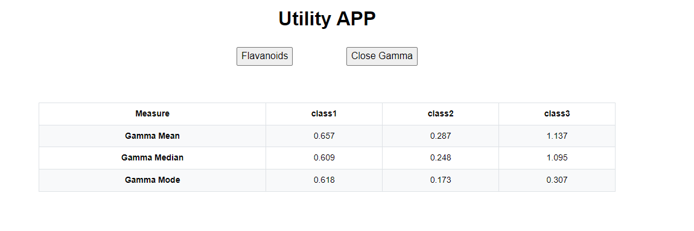

# Utility App

This utility app is designed to analyze and present statistical data related to wine properties. The app provides a user-friendly interface for analyzing wine data, enabling users to quickly understand the distribution and characteristics of specific wine properties.


## Outputs

**Falvonoids Table**


**Gamma Table**


## Prerequisites
- Node.js and yarn installed on your machine.

## Getting Started
1. Clone the repository:

```js
git clone https://github.com/BathlaNeffi/AnalyticsUtilityApp.git
```
2. Navigate To the Project Directory 

```js
cd analystics
```
3. Install dependencies: 

```js
yarn add
```
## Running the Project

To run the project locally, you can use the following yarn scripts:

- **Development Mode:**  Starts the development server.

```js
yarn start
```

- **Production Build:** Builds the app for production to the build folder.

```js
yarn build
```


## Usage

Once the development server is running, you can access the utility app in your browser at http://localhost:3000/. Try typing in the input field to see the autocomplete feature in action.

## Conclusion

This README provides a basic overview of the project and instructions for running it locally. For more details on the code implementation, please refer to the source files in the src directory.
